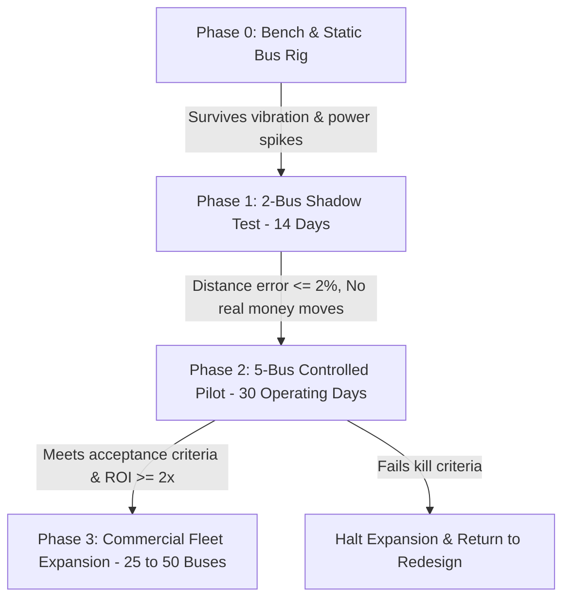

# Bhada: Architectural Gap Analysis & Project Improvement Plan

**Reference Document:** `resources/generated_reports/Bhada_Complete_Project_Report.docx` (Consolidated Edition, October 2026)  
**Target Repository:** `bhada/`  
**Purpose:** Reconcile the working prototype codebase with the rigorous commercial, regulatory, and field-operations standards established in the consolidated feasibility report.

---

## Executive Overview: The Core Strategic Shift

The consolidated project report reinforces that Bhada’s defensible moat is **not consumer QR ticketing**—generic QR payments and cash already exist in Nepal. Bhada’s true product is:

> *"An offline-first operating and revenue-assurance layer that gives transport operators, route companies, and regulators a verifiable record of passengers, distance, fares, and cash while continuing to work when connectivity fails."*

To transition from a software proof-of-concept into a commercially viable, regulator-approved transit platform, the following engineering, protocol, and operational improvements must be implemented across the `bhada/` codebase.

---

## 1. Tariff Engine & Regulatory Pricing Alignment

### Current Code State (`bhada/protocol/meter.mjs`)
* The prototype currently hardcodes an unapproved demonstration tariff:
  ```javascript
  export const TARIFF = {
    code: 'NPR-KTM-DEMO',
    currency: 'NPR',
    boardingCharge: 15, // First 3 km
    includedKm: 3,
    perStep: 3,         // Rs 3 / km
    stepKm: 1,
    cap: 25             // Max Rs 25
  };
  export const CONCESSION_RATE = { none: 1, student: 0.5, senior: 0.5, staff: 0 };
  ```

### Required Improvements
1. **Implement Official Bagmati Province Gazetted Distance Brackets (Baisakh 2083 Revision):**
   * Public transport pricing in Kathmandu Valley is legally determined by the Bagmati Province Ministry of Transport. Continuous dynamic per-km pricing is unauthorized.
   * Add the official gazetted fare table to `TARIFFS` in `protocol/meter.mjs`:
     * **0.0 to 5.0 km:** NPR 24.00 *(Student/Senior Concession: NPR 13.00)*
     * **5.1 to 10.0 km:** NPR 33.00 *(Student/Senior Concession: NPR 18.00)*
     * **10.1 to 15.0 km:** NPR 39.00 *(Student/Senior Concession: NPR 21.00)*
     * **15.1 to 20.0 km:** NPR 44.00 *(Student/Senior Concession: NPR 24.00)*
     * **Above 20.0 km:** NPR 50.00 *(Student/Senior Concession: NPR 28.00)*
2. **Correct Concession Discount Rate:**
   * Statutory Nepal student and senior citizen discount is **45%** (a multiplier of `0.55`, rounded down/up to official gazette), not `0.50` (50%).
3. **Reposition GNSS/GPS Role:**
   * Update `priceDistance()` so that GPS odometer distance is strictly used as a **stage/bracket determination and audit witness**, not a continuous linear multiplier.
4. **Boundary Hysteresis & Fallbacks:**
   * Introduce a buffer zone near boundary transitions (e.g. 4.98 km vs 5.02 km) to prevent noisy GPS fixes from flipping passengers into a higher bracket.
   * When GPS horizontal dilution of precision (HDOP) degrades (e.g. underpasses, heavy urban canyons), fallback to an auditable route-stage selection with an explicit `reason` code logged in the receipt.

---

## 2. Conductor Economics: Value-Share Model vs. Fixed Bonus

### Current Code State (`bhada/protocol/crew.mjs` & `migrations/0025_crew_bonuses.sql`)
* Clean trip bonuses are currently paid as a static bounty:
  ```javascript
  export const CLEAN_TRIP_BONUS_NPR = 50;
  ```
* This Rs 50 is debited directly from the operator’s fare payable for every trip where recorded tickets match sensor counts.

### The Problem Identified in Report
* At 8–10 trips per day across 26 operating days, a fixed Rs 50 bonus costs **NPR 10,400–13,000 per bus per month**.
* If a bus recovers only NPR 6,000 in previously unrecorded cash, a fixed Rs 10,400 bonus wipes out the bus owner's entire financial return and causes immediate operator cancellation.

### Required Improvements
1. **Transition to Recovered Value-Share Formula:**
   * Replace fixed Rs 50 with a **capped percentage of verified incremental revenue** (e.g. 25% of measured recovery) or a tiered accuracy scale:
     * Discrepancy $> 10\%$: NPR 0 bonus (flagged for review).
     * Discrepancy $5\%–10\%$: NPR 25 bonus.
     * Discrepancy $< 5\%$: NPR 50 bonus (capped by maximum daily operator allocation).
2. **Operator Net Benefit Guardrail:**
   * Ensure that `award_clean_trip()` validates that net owner collection is positive after deducting the Bhada SaaS fee and crew bonus:
     $$\text{Net Benefit} = R_{\text{recovered}} - B_{\text{bhada}} - I_{\text{incentive}} > 0$$

---

## 3. Schema & Token Consistency

### Current Conflict
* The master strategy document and app UI intermittently refer to Cash Tickets as **`BC1`**, while the cryptographic protocol in `bhada/protocol/cash.mjs` strictly defines:
  ```javascript
  export const CASH_VERSION = 'CT1';
  ```

### Required Improvements
1. **Unify on `CT1`:** Formally standardize on `CT1` across all documentation, UI components, conductor manuals, and database schemas.
2. **Explicit Compatibility Mapping:** If legacy tests or QR payloads emit `BC1`, implement a parser normalization layer in `protocol/token.mjs`:
  ```javascript
  export function normalizeTokenVersion(raw) {
    if (raw.startsWith('BC1|')) return 'CT1|' + raw.slice(4);
    return raw;
  }
  ```

---

## 4. Offline Risk & Credit Settlement Controls

### Current Code State (`bhada/protocol/policy.mjs`)
* Overdraft limit is hardcoded:
  ```javascript
  export const OVERDRAFT_NPR = 50;
  export const TAP_MAX_AGE_S = 300;
  ```

### Required Improvements
1. **Partner-Approved Prefunding / Escrow:**
   * Signatures on `BT1` passenger tokens prove key authenticity, but do not guarantee remote wallet liquidity.
   * Add a `maxOfflineRidesPerDay` policy (e.g. maximum 2 offline un-synchronized rides or NPR 70 cumulative exposure) before requiring an online wallet heartbeat.
2. **Dispute & Refund SLA Integration:**
   * Implement automated dispute timeouts for dead-phone claims (`BD1`) in `protocol/dispute.mjs` so claims resolve within 48 hours rather than remaining in pending state indefinitely.
3. **Idempotency & Replay Protection Across Disconnected Buses:**
   * Strengthen `settleBatch()` to detect when a single passenger key signs duplicate taps across two different vehicles during the same offline synchronization window.

---

## 5. Physical Hardware & Sensor Realities

### Current Code State (`bhada/validator/`)
* Assumes a single-beam break sensor connected to GPIO:
  ```javascript
  // validator/loader.mjs
  ```
* Evaluated against desktop proofs (`npm run proof:validator`).

### Field Reality (Kathmandu Fleet)
* 95% of Kathmandu minibuses (Tata LP 407, Eicher 10.75, Force Traveller) feature a **single narrow manual door** where passengers board and alight simultaneously, carrying luggage, bags, and children. A single break-beam sensor suffers severe miscounting.

### Required Improvements
1. **Support for Bidirectional Optical Sensors (ToF / Dual-Beam):**
   * Upgrade door counting interface in `src/device/terminal.js` to accept directional events (`ENTER`, `EXIT`) from overhead Time-of-Flight (ToF) or stereoscopic infrared sensors.
2. **Confidence-Degraded State:**
   * Instead of outputting an absolute count when sensor readings are noisy or blocked, emit a `sensorConfidence` metric (e.g. `HIGH`, `MEDIUM`, `DEGRADED`).
   * When confidence is `DEGRADED`, disable automatic clean-trip penalties on crew to prevent false accusations.

---

## 6. Commercial Model: Phased "Land-and-Expand" Rollout

### The Software-First (Phase A) Architecture
To eliminate upfront CapEx bottlenecks, Bhada must cleanly distinguish between its product tiers:

| Tier | Target Fleet | Hardware Required | Monthly Bhada Fee | Features Included |
| :--- | :--- | :--- | :--- | :--- |
| **Operator Basic (Phase A)** | Small private operators, route committees | Conductor Android Smartphone only (NPR 0 CapEx) | **NPR 1,500 – 2,000 / bus** | Conductor app (`/conductor`), `CT1` cash tickets, QR/NFC passenger tap, daily revenue report, cloud sync |
| **Operator Pro (Phase B)** | High-capacity trunk routes (R11, Mahanagar) | Fixed Pi Validator + Overhead Optical Counters | **NPR 3,000 – 4,000 / bus** *(or NPR 2k SaaS + 1k lease)* | Fixed stanchion validator (`/terminal`), automated passenger counting, full anti-leakage audit, clean-trip bonuses |
| **Enterprise / B2G** | Municipalities (KMC), Sajha Yatayat | Full telematics + clearinghouse API | Negotiated annual contract | Open GTFS-RT streaming, corridor occupancy heatmaps, inspection tools |

---

## 7. Pilot Execution & Rigorous Pass/Fail Targets

The project must follow a strict, gated pilot sequence before committing capital to hardware:



### Quantitative Acceptance Targets (5 Buses × 30 Operating Days)
* **Scan Transaction Latency:** p95 $< 1.0\text{ s}$ under realistic passenger positioning.
* **Distance Accuracy:** Median road distance error $\le 2.0\%$ against surveyed GPS traces.
* **Reconciliation Accuracy:** $\ge 95\%$ of counted passengers accounted for by digital/cash ride tokens.
* **Sync Reliability:** $> 99.5\%$ of offline queued batches successfully uploaded on 4G return.
* **Commercial ROI Ratio:** Verified recovered revenue $\div$ Bhada monthly fee $\ge \mathbf{2.0x}$.

### Explicit Kill / Pivot Criteria
Immediately halt expansion if the 30-day pilot demonstrates:
1. Optical counter accuracy falls below **$90\%$** in live single-door crowded conditions.
2. Conductor bypass rate exceeds **$10\%$** of cash passengers despite incentives.
3. Measured revenue recovery is less than **$1.5\%$** of gross collections.
4. Maintenance and field support costs exceed **NPR 1,000 / bus / month**.
5. Operator willingness-to-pay drops below **NPR 1,500 / bus / month**.

---

## 8. Prioritized Engineering Action Checklist

- [ ] **Protocol Update:** Add Bagmati Province 2083 gazetted distance brackets and 45% concession calculation to `protocol/meter.mjs`.
- [ ] **Protocol Verification:** Update test suites in `test/meter.test.mjs` and run `npm run proof:meter` to verify that official brackets pass all 21 stage pairs.
- [ ] **Incentive Update:** Modify `protocol/crew.mjs` and `award_clean_trip()` to support variable/tiered value-sharing instead of fixed NPR 50.
- [ ] **Token Naming:** Ensure `CT1` is standard across all UI code and export compatibility shims for `BC1`.
- [ ] **Conductor App Hardening:** Ensure the conductor phone interface (`src/device/terminal.js` / `/conductor`) operates completely offline with instant one-touch cash buttons and spoken Nepali audio feedback.
- [ ] **Field Pilot Instrumentation:** Build an automated daily pilot audit report in `scripts/lib/` comparing `Counter_Boardings` vs. `Recorded_Fares` vs. `Reported_Cash`.
