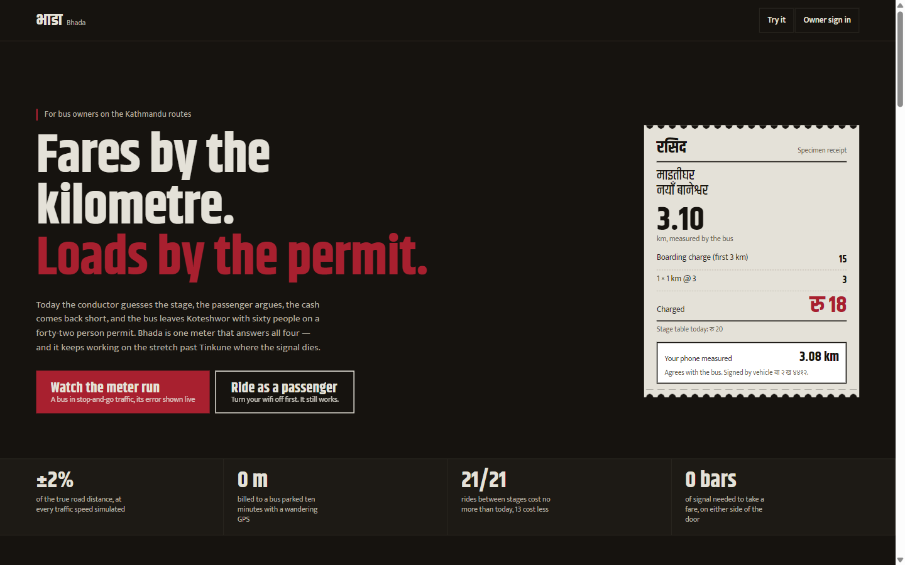
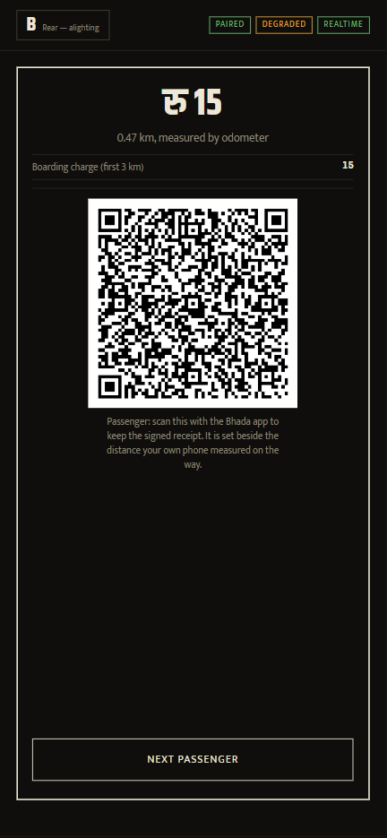
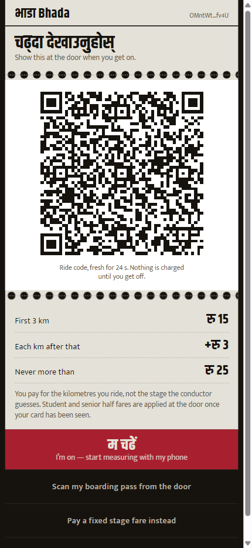
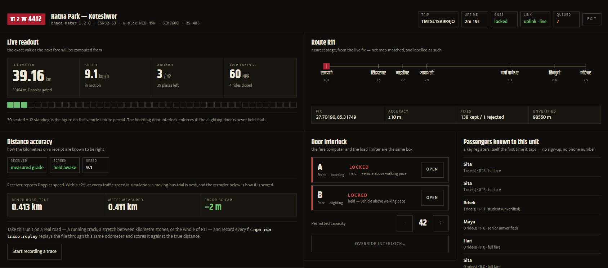
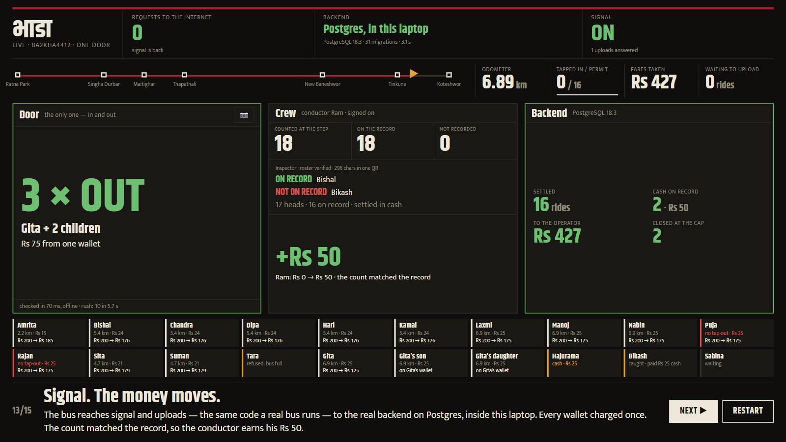

# Bhada — भाडा

**Bus fares by the kilometre, loads by the permit, and no signal needed for either.**

Kathmandu's buses have no fixed stops. People wave one down between junctions and
step off wherever traffic stalls, yet fares are priced from a stage table, so the
conductor guesses, the passenger argues, the cash comes back short, and nobody can
prove anything. The same buses leave Koteshwor with sixty people on a forty-two
person permit, because nothing counts heads.

Bhada is one meter that fixes both:

- **A meter** (a spare Android phone under the seat) measures the road from GPS
  and prices each ride by the kilometre actually ridden.
- **A door terminal** at the bus's one door (the conductor's phone, or a fixed
  validator) opens and closes rides with a tap, records cash fares, and refuses
  the next boarding once the bus reaches its permit — while the door stays open
  for people getting off, because it is the only way out.
- **A counter at the step** counts bodies, so anyone who rides without tapping
  shows up as a gap between the count and the record, and the crew's bonus
  depends on closing it.
- **The passenger's own phone** signs every ride it takes, measures the ride
  itself, and keeps a signed receipt it can check against its own count.

Where an operator wants a fixed box instead of a phone at the door, the **door
validator** is a Raspberry Pi with a QR scanner, a card reader and a small
screen, running the same door code unchanged ([section 9b](#9b-the-door-validator-raspberry-pi)).

All of it completes with no network on any device. Reaching the internet is how
money moves afterwards, never how a fare gets taken. That is the lesson of Sajha,
Bharatpur and Pokhara: three digital ticketing rollouts that worked in the demo
and died on the bus, because they needed a signal at the moment of payment.



**The whole project in one document, with screenshots and a scene-by-scene demo script:** [docs/Bhada-project.pdf](docs/Bhada-project.pdf).

---

## Contents

1. [Status](#1-status)
2. [A ride, end to end](#2-a-ride-end-to-end)
3. [Everyone who has to trust it](#3-everyone-who-has-to-trust-it)
4. [How the kilometres are known to be right](#4-how-the-kilometres-are-known-to-be-right)
5. [The tariff, and the promise it keeps](#5-the-tariff-and-the-promise-it-keeps)
6. [Security: who can charge whom](#6-security-who-can-charge-whom)
   - [Crew economics: what the system gives back](#6b-crew-economics-what-the-system-gives-back)
7. [The door interlock](#7-the-door-interlock)
8. [Wire formats](#8-wire-formats)
9. [Architecture](#9-architecture)
   - [The door validator (Raspberry Pi)](#9b-the-door-validator-raspberry-pi)
10. [Running it](#10-running-it)
11. [The proofs](#11-the-proofs)
12. [The database](#12-the-database)
13. [Deploying](#13-deploying)
14. [Design, motion and sound](#14-design-motion-and-sound)
15. [Known limits](#15-known-limits)
16. [The September 2026 audit](#16-the-september-2026-audit)

---

## 1. Status

| Piece | State |
| --- | --- |
| Distance meter, odometer fusion | ✅ Within ±2% of true road distance at every traffic speed simulated — `npm run proof:meter` |
| Fare correctness, passenger's view | ✅ 99.5% of 400 random simulated rides charged exactly the true fare; none more than one step off |
| Door terminals, tap in / tap out | ✅ Offline, one gesture, either door, verified end to end in a real browser |
| Passenger ride card | ✅ Signed ride code, the phone's own odometer as a witness, signed receipts kept on the phone |
| Tap consent at settlement | ✅ No leg settles without the passenger's signed tap — `npm run proof:legs` on real Postgres |
| Door interlock | ✅ Capacity from the permit, exit never held, audited override, `door_events` tape |
| Owner dashboard | ✅ Stage fares and metered rides: passenger-km, Rs per km, measured share, overloads. Buses are registered by zone, lot, series and number with a live plate preview |
| Routes | ✅ Nine Kathmandu Valley routes on the backend with their stops. The phones still carry only R11's stage table and map |
| Stage-fare path (BH1) | ✅ Unchanged and still works underneath |
| Local backend fallback | ✅ `npm run sync:local` settles everything the hosted function does |
| Real GNSS on a moving bus | ⬜ Not yet. The trace recorder and `npm run trace:replay` are how it gets scored |
| Route distance | ✅ A leg with no odometer figure is measured along the published route: under 1% off on all 21 stage pairs, where the old straight-line guess was up to 34.8% off |
| Concessions | ✅ A half fare needs an AT1 attestation from a registered office; an unbacked claim settles at the full fare, never refused |
| Dead-phone claims | ✅ A ride charged the unclosed cap can be re-priced once from the passenger's own signed odometer record (BD1) |
| Passenger privacy | ✅ Rides are signed with a fresh key each day; the operator cannot link two days to one wallet |
| Receipt plausibility | ✅ Every settled leg is scored against what a bus can physically do; flagged, never refused |
| Micro-overdraft | ✅ A metered ride can take a wallet to −Rs 50 rather than strand the passenger; the next top-up clears it |
| DoTM returns | ✅ Daily rides, passenger-km and the overload register, exported as CSV from the dashboard. Nothing is filed yet |
| Web NFC, rider cards | ✅ Tap-and-go on Chrome for Android, cards mapped by serial; the camera path always stays |
| Pitch demo | ✅ [`/demo`](https://bhada-one.vercel.app/demo): a whole one-door bus on one screen — rush hour, a cash rider, a family, a fare dodger caught by the counter and an inspector, the conductor's bonus — with the real backend on Postgres inside the browser and zero requests to the internet. Section 10 |
| One-door buses | ✅ The door is the way in and the only way out: at the permit the next tap-in is refused and the door stays open for people getting off (`DOOR_ROLE.BOTH`). A rear door, where a bus has one, still works |
| Cash riders | ✅ The conductor records a cash fare in two taps: a CT1 cash ticket signed by the bus and priced by the tariff, checked again at settlement. No wallet moves; it is what the crew owes the owner |
| Door counter and the crew bonus | ✅ in software: bodies counted at the step against rides + cash tickets per trip; the Rs 50 bonus needs 90% on the record, and a counter that goes quiet earns nothing. The break-beam itself is not wired to a bus yet |
| Inspection | ✅ `/inspect`: the meter signs a roster (RS1); an inspector's phone checks it offline against the bus register and marks each passenger ON RECORD or NOT ON RECORD |
| Families on one phone | ✅ Up to four companions on one code (BG1), each with a key derived from the payer's seed and all fares on the payer's one wallet |
| USB scanner at the door | ✅ A GM65-class scanner on OTG, in keyboard mode, feeds ride codes to `/terminal` in a fifth of a second instead of the camera's 1.5–6 s. Checked in a real browser; not yet timed at a real door |
| Door validator (Raspberry Pi) | 🟨 Built and proved in software — `npm run proof:validator`, 124 checks: the unchanged door on Pi adapters, offline, scanner, PN532, DS3231, RS-485, every screen's QR decoded from pixels. Not yet run on the parts |
| Live site | ✅ [bhada-one.vercel.app](https://bhada-one.vercel.app) runs this build (28 Sep 2026): landing, `/app`, `/terminal`, `/device`, `/crew`, `/inspect`, `/operator`, `/admin` and `/demo` load live, and the app works offline. The full demo was run end to end on the live site |
| Passenger accounts | ✅ `/app/account`: email or mobile-code login, the phone links its wallet with a signature (AL1), a day-by-day statement with the balance after each movement, top-up, and an optional Face ID / fingerprint lock |
| Lost phone | ✅ Signing in on a new phone offers **Move my money to this phone**: the balance, any overdraft and the history move with the login (migration 0029). Rides the old phone already took still settle; new ones it starts are refused |
| Top-up | ✅ eSewa only. Through eSewa's sandbox gateway it is credited only after eSewa confirms; if the gateway is off, the passenger pays the merchant number, enters the transaction ID, and an admin loads it |
| Super admin | ✅ `/admin`: platform totals, the top-up queue, every wallet with its statement, cash loading, corrections with a reason, suspension of passengers and operators, merchant settings |
| Crew economics | ✅ A conductor signs on with a CR1 from their own wallet; a clean trip pays them Rs 50, taken out of the operator's fare payable rather than minted. A meter that loses its 12 V feed on a moving bus writes `power_lost` and the trip pays nothing |
| Live backend | ✅ Supabase runs migrations 0001–0031 and the sync function (28 Sep 2026: cash tickets, door counts, the inspector's key register), and the payments function (18 Sep 2026). Signed rides were sent to it over HTTPS and behaved as proven: settlement, replay, missing tap, forged receipt, forged tap, overdraft floor. Owner sign-up and company registration work live |

---

## 2. A ride, end to end

```
 PASSENGER PHONE              DOOR A (front)          METER (under seat)        DOOR B (rear)
 ───────────────              ──────────────          ──────────────────        ─────────────
 ride code: BT1  ──camera──▶  verify signature
 signed by the                check bus not full ◀─── occupancy, 1 Hz
 passenger, fresh             stamp odometer    ◀──── odometer reading
 every 30 s                   sign BO1 pass (vehicle key)
                  ◀──camera── pass shown as QR ─────▶ ride opens, fare accrues
 phone starts its                                     GNSS → odometer
 own odometer                                         doors held above 0.8 m/s
                                                                                  
 ride code or pass ──────────────────────────────────────────────camera──────▶  verify pass
                                                                                 read odometer
                                                                                 price by km
                                                                                 sign BM1 receipt
                  ◀──────────────────────────────────────────────camera──────  receipt as QR
 receipt checked:
 arithmetic, and
 bus km vs phone km

 later, whichever device finds a signal first:
   BM1 receipt + BT1 tap ──▶ sync function: vehicle signature ✓  passenger signature ✓
                              tap belongs to this ride ✓  tap used once ✓  re-priced ✓
                              settle_leg() moves the money, once
```

- **Nothing is charged at boarding.** A fare quoted before anyone knows the
  distance is a fare that was guessed.
- **One door, one gesture.** A Nepali bus has one door, in and out. A key with a
  ride open is getting off; any other key is getting on. Nobody picks the right
  button on a moving bus. (A large bus with a second, rear door works too: the
  boarding snapshot travels on the passenger as a pass signed by the vehicle,
  so the two doors never need to reach each other.)
- **Riders without a smartphone** get a rider card at the door (on real hardware
  an NFC card whose key never leaves its chip; in this build the door phone holds
  it on the card's behalf, and says so on screen).
- **A ride nobody closes** is charged the route cap when the trip ends or its pass
  expires after six hours, so tapping out never becomes optional. The cap is
  halved for concessions: an unclosed ride must never be cheaper than a closed
  one, but no closed student ride can cost more than half the cap.

| Door terminal, closing a ride | Passenger ride card |
| --- | --- |
|  |  |

---

## 3. Everyone who has to trust it

| Who | What they get | What stops them being cheated |
| --- | --- | --- |
| **The owner** | Every rupee with its kilometre, door and hour; Rs per passenger-km per bus; which bus stopped reporting; the overload record | Receipts are signed on the bus and re-priced by the backend from the published tariff |
| **The passenger** | Pays for kilometres ridden, never more than today's stage fare between the same stages; a second measurement on their own phone | No ride settles without their own signed tap. Receipts carry the arithmetic |
| **The crew** | No arguing about stages; whole-rupee fares; the door, not the conductor, says the bus is full | The interlock override is always available and always logged, so an emergency is never blocked |
| **The regulator** | A tamper-evident record of every time a bus sat at its permit and every override | `door_events` uploads with the fares and cannot be edited from the dashboard |

---

## 4. How the kilometres are known to be right

### The problem

A phone's GPS is a noisy ruler. Parked at a junction it wanders several metres a
minute; under the Koteshwor flyover it jumps hundreds of metres. Summed raw, it
bills people for sitting in traffic. Filtered badly, it bills nothing at all. The
first odometer in this project did the second: it compared each fix to the one
before it and ignored steps under 8 m, and at one fix a second a bus doing under
29 km/h never makes an 8 m step. **It read zero at every speed a Kathmandu bus
actually drives**, and the proof never noticed because its scripted drive ran at
exactly 40 km/h. See [the audit](#16-the-september-2026-audit).

### The odometer, now (`applyFix` in `protocol/meter.mjs`)

1. **Gates.** A fix vaguer than 35 m is dropped. A fix implying more than
   120 km/h is multipath and is dropped *without moving the anchor*, so the
   bounce back is not a second jump; three consistent "impossible" fixes in a row
   are accepted as a relocation and booked as unverified, never billed.
2. **Motion from Doppler.** Browsers expose the receiver's Doppler speed
   (`coords.speed`), which is measured from the carrier frequency, not
   differenced from noisy positions. Below 0.5 m/s the bus is standing, and the
   anchor follows the fix so wander never accumulates.
3. **Chords, held.** While moving, the anchor is held until the bus is 12 m away,
   then the chord is counted. Shorter chords sum the receiver's noise into the
   distance (+3.5% at walking pace with 8 m); longer ones cut corners (−2% on the
   open road with 20 m). 12 m was chosen by sweeping the proof's drives.
4. **Stops book the remainder.** When Doppler says the bus has stopped, the
   distance since the last chord is counted, capped by the Doppler-integrated
   distance. Otherwise every junction would forfeit up to a chord.
5. **The reading is a ratchet.** Taps are stamped with counted metres plus the
   distance held mid-chord, and the reading never runs backwards.
6. **Without Doppler** (a laptop, some browsers) motion is judged from 10 s of
   displacement, and every doubt resolves towards the passenger: the meter may
   under-read in stop-and-go traffic, and it never over-reads.

### The evidence

`npm run proof:meter` drives a 6.2 km road with sharp corners at seven junctions
and bends every 220 m, with a receiver whose error wanders like a real chip's
(Gauss–Markov, σ 2.5 m, τ 30 s, plus 0.8 m jitter). Five independent drives per
row, worst case reported:

| Drive | With Doppler (measured grade) | Position only (conservative grade) |
| --- | --- | --- |
| Walking the demo, 5 km/h | +1.11% | −0.01% to +1.31% |
| Jam crawl, 11 km/h | +0.67% | −0.02% to +0.42% |
| City traffic, 22 km/h | −1.18% | −1.22% to +0.60% |
| Open road, 40 km/h | −1.30% | −0.50% to −0.08% |
| Stop-and-go junctions | −0.81% | −6.33% to −4.57% |
| Signal bouncing off buildings | −0.59% | −0.62% to +0.75% |
| Ten minutes parked, 4 m wander | 0.4 m billed | 12.5 m billed |

Then the number that matters to a passenger: 400 random rides across a simulated
5.3 km day with 24 stops, each priced from the odometer and from the true road
distance. **398 (99.5%) were charged exactly the true fare. Two were one step
(Rs 3) high. The worst distance error on any ride was 30 m.**

### Checking it on a real road

A simulation is only as good as its receiver model, so the meter carries the
means of checking it:

1. On `/device`, **Distance accuracy → Start recording a trace**. Every raw fix is
   kept, with the reason it was accepted or rejected.
2. Ride a road whose length is known by something other than GPS — a car's trip
   meter over the same path, kilometre stones (enter each as a mark with its
   distance), a 400 m track, or the whole of R11.
3. **Stop and save trace** downloads a JSON file. Then:

```bash
npm run trace:replay -- trace.json                     # summary: receiver, rejections, total
npm run trace:replay -- trace.json --truth 7520        # against a measured total
npm run trace:replay -- trace.json --route r11.geojson # against the road's polyline (OpenStreetMap export)
npm run trace:replay -- --demo sample.json             # write a simulated trace to see a report
```

It replays the file through the same odometer, reports cross-track error
against the route, and scores every marked segment in kilometres and in rupees.

The passenger's phone does the same check on every ride: it runs the same
odometer from its own receiver and sets its distance beside the bus's on the
receipt. The bench drive on `/device` shows the meter's live error against a road
of known length, in the room, with no bus.



---

## 5. The tariff, and the promise it keeps

```
fare  = min( cap , boardingCharge + ⌈ max(0, km − includedKm) / stepKm ⌉ × perStep )
final = ⌈ fare × concessionRate ⌉            concession: none 1, student ½, senior ½, staff 0
```

Tariff `NPR-KTM-2026B`: **Rs 15 covers the first 3 km, then Rs 3 per whole
kilometre, never above Rs 25.** Whole kilometres, rounded up, because the number
has to be arguable at the door by two people with no calculator.

**The promise: no ride between two stages costs more metered than the stage table
charges for it today.** The first tariff (`NPR-KTM-2026`, first 2 km) was sold on
that promise and broke it on three stage pairs — Thapathali to New Baneshwor was
Rs 15 by stage and Rs 18 metered. Rs 15 for 3 km is the smallest change that
keeps it; `proof:meter` checks all 21 pairs, and 13 of them get cheaper.

| Ride | Road | Stage fare today | By the kilometre |
| --- | --- | --- | --- |
| Ratna Park – Singha Durbar | 1.5 km | Rs 15 | Rs 15 |
| Ratna Park – Thapathali | 2.9 km | Rs 25 | Rs 15 |
| Maitighar – New Baneshwor | 3.1 km | Rs 20 | Rs 18 |
| Thapathali – Koteshwor | 4.6 km | Rs 25 | Rs 21 |
| Singha Durbar – Tinkune | 5.1 km | Rs 25 | Rs 24 |
| Ratna Park – Koteshwor | 7.5 km | Rs 25 | Rs 25 |

Tariffs are added, never edited. A receipt names its tariff code and is re-priced
with that tariff (`TARIFFS` in `protocol/meter.mjs`, the `tariffs` table), so a
tariff change never turns last month's honest receipts into mismatches, and a
code nobody published prices nothing.

The tariff is a proposal, not a gazetted fare.

---

## 6. Security: who can charge whom

### Two signatures per ride

| Token | Signed by | Says |
| --- | --- | --- |
| **BT1** ride code | the passenger | "this key is boarding this vehicle, now" — valid 300 s, one use |
| **BO1** boarding pass | the vehicle | "you boarded at this odometer reading, here, now" |
| **BM1** receipt | the vehicle | "you rode this far; here is the arithmetic" |

A passenger's public key is not a secret — it is in every QR they have ever shown.
So a vehicle signature alone must not be able to bill anyone. It could, until
this audit: the tap was checked at the door and then thrown away, and the backend
settled any vehicle-signed receipt for any passenger key.

Now the tap travels with the ride (`tapQr` on every leg row, on the in-vehicle
link, and in every upload), and **the backend settles a leg only with the
passenger's tap on file**:

- signed by the passenger the receipt bills (`bad_tap` otherwise),
- for the vehicle the receipt is from, made within 300 s of the receipt's
  boarding time (`tap_mismatch`). The window is `TAP_MAX_AGE_S` at the door and
  the same number in `settle_leg()`, wide enough for a phone a fortnight off
  the network,
- used for exactly one ride — a unique index on `(passenger, tap nonce)`
  (`tap_reused`).

A receipt that arrives before its tap is held as `awaiting_tap`, not refused: the
two door phones may have had no signal between them, and the boarding door — the
one that saw the tap — may upload hours later. `npm run proof:legs` runs every
case on real Postgres, including a receipt with no consent, an operator-forged
tap, another passenger's tap, a genuine tap stretched to a second ride, and a tap
that arrives late.

### Everything else

| Threat | Defence |
| --- | --- |
| Edited fare or distance | Receipt re-priced server-side from the published tariff; edits break the vehicle signature |
| Replayed receipt | `legs.leg_id` primary key; the second upload is answered `replay`, which is final |
| Screenshot of a ride code | 300 s validity, refreshed every 30 s on the phone, nonce spent at the door |
| A typed "student" | AT1 attestation checked offline at the door and against `concession_issuers` at settlement; without one the leg is charged the full fare |
| Mock-location meter | `protocol/plausibility.mjs` scores each leg (too fast, no elapsed time); `meter_plausibility` gives the owner a rate per bus. A score, not a refusal |
| A fleet following a commuter | A new key per Kathmandu calendar day (`protocol/pseudonym.mjs`); the day-key → wallet link (PK1) lives only in `passenger_keys`, service role only |
| Farming the signup credit with new day-keys | `register_device()` resolves through `wallet_for()`; a known day-key gets no credit |
| A dead phone charged the cap | BD1 claim, signed by the key that tapped in, priced at the phone's own distance; once per leg, refused or not |
| A wallet driven into unbounded debt | `settle_leg()` stops at `−overdraft_npr` (Rs 50), and the table check enforces the same floor |
| Pass from another bus | Verified against this vehicle's key |
| Stage-fare double spend (BH1) | Monotonic sequence numbers, unique index, Rs 500 offline cap, 24 h settlement window |
| Public anon key | Row Level Security: anon reads published fares, stops and tariffs, nothing else |
| Owner reading other owners' data | RLS by `current_operator_id()` on vehicles, trips, transactions, legs, door events |

What is not defended yet is in [Known limits](#15-known-limits).

---

## 6b. Crew economics: what the system gives back

Every other part of this takes something away from a conductor. Under cash an
uncounted passenger is the conductor's own money; once every boarding runs
through a door terminal there is nothing left to skim. A system that only takes
is a system the crew will defeat, and the cheapest way to defeat this one is a
ten-second reach under the seat for the meter's 12 V plug.

So two halves, and neither works without the other.

**The mark.** `assessPower()` in `protocol/crew.mjs` decides when a charger
going away is a feed being pulled: gone for 120 s, on a bus whose odometer moved
inside the last 600 s. A bus parked with the ignition off loses the same socket
and raises nothing. The event lands in `meter_events`, deliberately not in
`door_events` — the door tape is the interlock record a regulator reads, and it
should stay about doors.

**The pay.** Rs 50, flat, to the crew member signed on, when the trip:

1. carried at least 5 rides — a bonus for a trip that carried nobody is free money;
2. never lost its power;
3. never overrode the capacity interlock;
4. metered nothing the plausibility score calls `high`.

Flat rather than a share of the takings, because a conductor can hold a flat
number in their head and argue about it, and the argument is the point. Rides
nobody tapped out of are deliberately not on that list: a tap-out is the
passenger's to give, and docking a crew for it would teach them to refuse anyone
whose battery looks low.

**Who the crew is.** There is no employee record and this does not invent one. A
conductor holds an ordinary Bhada wallet — the same one they ride on — and signs
on at `/crew` with a **CR1** their own phone signs: their key, the bus, the
minute. It is the mirror of the passenger's tap. A tap is consent to be charged;
a sign-on is consent to be credited and named on the trip. One sign-on covers a
whole shift, so the console checks it inside 300 s (the one moment a screenshot
of somebody else's sign-on could be held up to a camera) and the backend inside
14 hours.

**Where the money comes from.** It is not minted. Bhada holds passenger balances
and owes the operator the fares their vehicles collected; the bonus is Rs 50
moved out of that payable into the crew member's wallet, both sides in one
`crew_bonuses` row. It lands on `wallet_for(crewKey)` like every other rupee,
which since day-keys is rarely the key the token names. A conductor who has never
used Bhada has no wallet, and that is recorded as `no_wallet` rather than paid
into thin air.

**Where it is decided.** In one place, as always: SQL counts the evidence
(`trip_evidence()`), `cleanTripVerdict()` rules on it, and `award_clean_trip()`
owns the money and the once-only rule. The rule for what makes a trip clean is
never re-implemented in SQL.

---

## 7. The door interlock

Overloading is not a billing problem; it is why people die on Nepali roads. The
meter already knows how many are aboard because it counted every tap, so the
same count holds the door — at no extra hardware cost, which is the argument for
one box rather than two.

| Rule | Behaviour |
| --- | --- |
| Boarding door at the permit | Held. The next tap is refused before a ride is opened |
| **Exit door at the permit** | **Never held.** A full bus is when people most need to get off |
| Any door above 0.8 m/s | Held |
| Crew override | Always opens, is one press, and writes an audit row with time, count and permit |

The rules live in `protocol/meter.mjs` (`doorDecision`), not in a component,
because a safety rule in a component is one refactor from disappearing. Capacity
is the permit figure on `vehicles.capacity`. On a bus with no actuator the
interlock is advice to the crew; the relay is the last 10% of the feature.

---

## 8. Wire formats

One line of text each, `|`-separated, every field restricted to the base64url
alphabet so no field can smuggle a separator. The signed message is the exact
string that travels — there is no re-serialisation step to disagree about.

```
BT1 | passenger key | vehicle | door | nonce | unix s | sig                            ride code
BO1 | vehicle | trip | leg | passenger | door | unit | odo m | lat µ° | lon µ° | unix s | concession | sig
BM1 | vehicle | trip | leg | passenger | board door | alight door | board odo | alight odo
    | distance m | source | board s | alight s | concession | amount | tariff | sig
BH1 | passenger key | plate | amount | from | to | seq | nonce | unix s | sig          stage fare
AT1 | passenger key | issuer key | concession | issued s | expires s | sig              concession card
BD1 | passenger key | vehicle | leg | witness m | witness s | lat µ° | lon µ° | nonce | unix s | sig
                                                                                       dead-phone claim
PK1 | wallet key | day key | day | wallet sig | day-key sig                              day-key link
CR1 | crew key | vehicle | unix s | sig                                                  crew sign-on
```

`source` is `odometer` (measured), `route` (endpoints placed on the published
route and measured along it, estimated), `gps` (endpoints × 1.3, estimated),
`stage` (no fix at all) or `unclosed` (nobody tapped out; priced by the cap
rule).

The meter's telemetry is a fixed 32-byte frame with CRC-32 — occupancy,
capacity, odometer, position in microdegrees, speed, time, open legs, takings and
eight flags — sized for a 2G SIM billed by the kilobyte and a LoRa duty cycle.
The same data as JSON is about 210 bytes.

---

## 9. Architecture

```
protocol/              platform-free ESM: browser, Node and Deno run the same file
  meter.mjs            odometer fusion, tariff + registry, route snapping, distance resolution, doors
  leg.mjs              BT1 / BO1 / BM1, verifyLegConsent (the tap binding)
  settle.mjs           settleBatch(): the one place a sync batch is verified
  attest.mjs           AT1 concession attestations
  crew.mjs             CR1 crew sign-on, the clean-trip rule (with the door count), the pulled-plug watcher
  cash.mjs             CT1 cash tickets: signed by the bus, priced by the tariff
  inspect.mjs          RS1 inspection roster, checking a rider against it
  dispute.mjs          BD1 dead-phone claims and how they are priced
  pseudonym.mjs        daily keys from a master seed, PK1 links
  account.mjs          AL1: a wallet signing that it belongs to a login
  gateway.mjs          eSewa: what is signed and what is checked (Khalti helpers kept, unused)
  plausibility.mjs     scores a leg against what a bus can do
  token.mjs            BH1 stage-fare token
  frame.mjs            32-byte uplink frame, CRC-32; also the meter's RS-485 heartbeat to a door validator
  policy.mjs           offline cap, settlement window, overdraft
src/
  pages/Landing.jsx    the public site; every fare on it computed by protocol/
  screens/Ride.jsx     passenger ride card: code, witness odometer, receipts
  screens/Passenger.jsx  stage-fare ticket (BH1)
  screens/Conductor.jsx  stage-fare collection
  screens/Device.jsx   the meter console, with the accuracy panel and recorder
  screens/Terminal.jsx a door terminal
  screens/Demo.jsx     the pitch demo: the whole system on one screen
  screens/Inspect.jsx  a fare inspector's phone, offline
  demo/                its stage (passengers, a compressed road, no internet) and Postgres in the browser
  device/meter.js      the on-vehicle unit: receiver, disk, link, bench drive, trace
  device/terminal.js   a door: issues passes, prices rides, carries taps
  device/positioning.js  Doppler-aware fixes, screen wake lock, trace recorder
  device/sync.js       uploads: fares, receipts with taps, taps on their own
  device/link.js       in-vehicle bus: BroadcastChannel + Supabase Realtime, state from what is heard
  device/nfc.js        Web NFC taps and rider cards (Chrome for Android only)
  device/fleet.js      which bus this device is provisioned for
  lib/scan-input.js    hardware scanner input: where a scan ends, what is worth verifying (phone and Pi)
  lib/voice.js         door announcements in Nepali
  lib/gnss-sim.js      seeded road + traffic + receiver simulator (proofs and bench)
  portals/             online-only, lazy-loaded, never precached
    operator/          owner dashboard, buses and routes, DoTM return
    account/           passenger wallet: statement, top-up, settings
    admin/             super admin console
    shared/            shell, sign-in, statement list, passkey lock, styles
validator/             the Raspberry Pi door validator, section 9b
  loader.mjs           runs src/device/terminal.js unchanged on Node, swapping four browser modules
  adapters/            SQLite for IndexedDB, RS-485 for the vehicle bus, PN532 for Web NFC
  hw/                  scanner, PN532, DS3231 clock gate, RS-485 frame sync, odometer, LED/buzzer, power
  ui/                  320x240 screens: a model from the door's state, SVG, RGB565 for the framebuffer
  deploy/              systemd units, config.txt, setup.sh
supabase/
  migrations/          0001–0031, see section 12
  functions/sync/      the sync Edge Function
  functions/payments/  eSewa top-ups
  functions/_shared/   GENERATED copy of protocol/ — never edit
scripts/
  meter-proof.mjs  handshake-proof.mjs  reconcile-proof.mjs  legs-proof.mjs  validator-proof.mjs
  trace-replay.mjs     score a real recorded trace
  lib/pg-core.mjs      every migration on PGlite + the ledger settleBatch() writes through (Node and browser)
  lib/pg-backend.mjs   the same, reading the migrations off disk (local fallback, proofs)
  local-sync-server.mjs  npm run sync:local
```

| Choice | Why |
| --- | --- |
| **Installed PWA**, not React Native | Cold start in airplane mode, installed from a link, no store, no sideloading |
| **tweetnacl ed25519** | 6 KB, audited, identical in browser, Node and Deno; 64-byte signatures fit a QR |
| **IndexedDB** | Real transactions: a fare and the wallet that paid it are one atomic write |
| **Supabase Postgres + one Edge Function** | Money rules are plpgsql plus unique indexes, so correctness does not depend on the caller |
| **PGlite** | The real migrations and functions, tested in-process on Postgres compiled to WASM |
| **Geolocation `watchPosition` + Doppler + Wake Lock** | The cheapest distance sensor on every phone, kept awake, filtered into a meter |
| **`protocol/` platform-free** | The fare dispute is settled by re-running the same arithmetic in three places |

No blockchain, no AI, no login for passengers: a device is an account, identified
by its wallet key, and it rides under a different key each day.

---

## 9b. The door validator (Raspberry Pi)

A box beside the door for an operator who does not want a phone there. A
passenger holds up the BT1 ride code on their phone, or taps a rider card, and
the box decides on the spot with no network.

| Idle | Boarded | Closed | Refused | Held |
|---|---|---|---|---|
|  |  |  |  |  |

**It is not a second implementation of the door.** It runs
`src/device/terminal.js`, the file the conductor's phone runs, unchanged under
Node. `validator/loader.mjs` swaps exactly four browser imports (IndexedDB for
SQLite, the in-vehicle link for the RS-485 heartbeat or the vehicle odometer,
Web NFC for a PN532, the wake lock for nothing), so every verdict, price and
signature still comes from `protocol/`, with no copy of it in C.

| Part | Job |
|---|---|
| Raspberry Pi Zero 2 WH | Runs Node and `protocol/` as-is |
| GM65 / GM805 QR module | Reads the ride code off a phone screen in about 0.2 s |
| PN532 | Rider cards, by serial, exactly as the phone door maps them. Never reads phones |
| 2.8" ILI9341, 320×240 | Verdict, fare, and the pass or receipt QR for the passenger's phone |
| DS3231 | Keeps time with the power off, so the 300 s tap window holds offline |
| RGB LED, buzzer | Green, red, amber. **No pin drives a door** |
| Vehicle DC-DC converter | Bus power in, stable 5 V out. No battery; no GPS, because distance comes from the vehicle's odometer |

Two rules the box adds that a phone did not need: it refuses before the door is
asked when no clock it trusts (DS3231, NTP, the meter's heartbeat) agrees with
the system clock, and its public-facing scanner accepts a pairing code only
while it has no vehicle key.

Wiring, setup, power-cut handling, the build stages and what still needs a real
bus are in [`validator/README.md`](validator/README.md). On a laptop, with no
hardware: `npm run validator:bench`.

Rides reach the database the way a phone's do: stored on the box, then sent as
signed JSON over HTTPS to the sync function whenever the bus has any internet
(4G dongle, hotspot, depot Wi-Fi), never twice. With `BHADA_ROLE=vehicle` one box
is the whole bus, with no phones at all.

---

## 10. Running it

Requires Node 22.13+ (the validator and its proof use the built-in `node:sqlite`).

```bash
npm install
npm run proof:all      # all five proofs, no network, no browser
npm run dev            # https://localhost:5173 and your LAN address (self-signed; camera needs HTTPS)
npm run build && npm run serve   # production build on http://localhost:4173, service worker included
npm run sync:local     # the backend on http://localhost:8787, every migration, real Postgres
```

Point the app at a backend in `.env.local`:

| Variable | Purpose |
| --- | --- |
| `VITE_SYNC_URL` | The sync endpoint (hosted, or `http://localhost:8787/sync`). Without it the app is offline-only |
| `VITE_SUPABASE_URL` | Fare table refresh and the owner dashboard |
| `VITE_SUPABASE_ANON_KEY` | Public by design; safe because of RLS |

### The pitch demo: `/demo`

One screen, one laptop, no bus and no internet. `/demo` runs the real meter,
both real doors, twenty passengers who sign real ride codes, and the real
backend: every migration applied to Postgres (PGlite) **inside the browser**,
settling through the same `settleBatch()` and `settle_leg()` production uses.
The header counts every request that tries to leave the laptop; it stays at 0.



Space or → moves to the next scene, one sentence of narration each:

| # | Scene | What the room sees |
|---|---|---|
| 1 | One bus. One door. No internet. | The counter at 0, Postgres booted in the browser |
| 2 | Amrita taps in | Signature checked by the door itself; nothing charged yet |
| 3 | Rush hour | Ten people in about six seconds through one door |
| 4 | Hajurama pays in coins | The conductor records a signed cash ticket at the tariff |
| 5 | Gita and her two children | One code, three people, one wallet |
| 6 | Bikash slips in | The counter at the step sees him; the record does not |
| 7 | The bus moves | The meter's bench drive along R11, with the page's clock moved forward to match |
| 8 | Three ways to cheat | A screenshot, a forged code, another bus's code: all refused |
| 9 | The permit | The bus fills; the next person is refused; the one door stays open and Amrita gets off |
| 10 | An inspector boards | Signed roster verified offline; Bishal on record, Bikash not; he pays cash |
| 11 | Tap out | Fares by the kilometre, spoken aloud |
| 12 | Koteshwor | The family taps out together; two never tapped out and pay the Rs 25 cap |
| 13 | Signal | Real settlement: every wallet before → after, the conductor's Rs 50 because the count matched |
| 14 | Send it all again | Every ride and cash ticket comes back `replay`; Rs 0 moved |
| 15 | Your turn | A judge opens `/app` on their own phone and boards through the laptop camera |

For a pitch, run it from the laptop itself so airplane mode cannot break it:
`npm run build && npm run serve`, then open `http://localhost:4173/demo`. The
live site has it too, at [bhada-one.vercel.app/demo](https://bhada-one.vercel.app/demo).
It keeps its own IndexedDB database, deleted at every start, so it never touches
a real door or wallet on the same browser. Postgres is about 16 MB and is loaded
only by `/demo`: no phone precaches it, and only `/demo` is allowed to compile
WebAssembly (`vercel.json`).

### The demo on real phones

1. Open `/device` (the meter) and `/terminal?door=A` (the bus's one door). Two
   tabs on one laptop find each other over `BroadcastChannel` with the network
   cable out; on separate phones, pair the door by scanning the meter's
   **Pair a door terminal** code.
2. On the meter, **Run bench drive**. The bus drives R11 in stop-and-go traffic
   and the accuracy panel shows the meter's error against the true road, live.
3. On a phone, open `/app` → **यात्रु** and show the ride code at door A (or
   issue a rider card at the door). Press **म चढें** to start the phone's own
   odometer.
4. Wait, then tap out at the same door. The receipt shows the kilometres, the
   arithmetic and a QR; scan it from the ride card to compare with the phone's count.
5. Record a cash rider with **नगद**, and try **Me + 2** on the ride card for a family.
6. Set capacity to the number aboard and try to board one more: refused, the door
   stays open for getting off, audit row on the tape.
7. On the meter, **Inspection code**; on another phone, `/inspect` scans it and
   then checks ride codes. **Upload to backend** to settle — never against a live
   plate from a test browser, because the first key a plate uploads is frozen.

---

## 11. The proofs

| Command | What it proves |
| --- | --- |
| `npm run proof` | The BH1 offline handshake: accept, replay, edited amount, forged key, offline cap |
| `npm run proof:meter` | Odometer accuracy against known roads (sections 1–2, 10), fare agreement over 400 rides (11), the tariff promise over 21 stage pairs (6b), receipts, tariff registry, tap consent, doors, unclosed rides, frame and CRC, the pulled-plug watcher and the clean-trip rule (12–13), the one-door interlock, and riders who do not tap — the door count, cash tickets, the inspector's roster, family codes (14) |
| `npm run proof:reconcile` | Stage-fare settlement on real Postgres: replay, tampering, forged tokens, balance running out |
| `npm run proof:legs` | Every migration on real Postgres through the local backend: honest settlement, replay, no-consent receipts, forged and borrowed taps, tap reuse, late consent, unclosed rides, dead-phone claims, concession attestations, DoTM returns, day-keys and the signup-credit hole, plausibility flags, the overdraft floor, owner sign-up and company registration, the owner views, and the crew bonus end to end — the clean trip, the pulled plug, the override, the empty trip, the forged sign-on, the crew swap, a conductor with no wallet, and a day-key paid on the wallet behind it; lost-phone wallet moves (24); cash tickets and the door count against the bonus, read as the owner, a stranger and anon (25); a family on one wallet and the public key register (26) |
| `npm run proof:validator` | The door validator: the unchanged door on its Pi adapters with fetch trapped (zero network calls); valid, malformed, forged, wrong-bus, expired and replayed BT1s; the 300 s edge checked against `settle_leg()`; a ride priced by the vehicle odometer with its BM1 verified and the boarding `tapQr` on the close; the clock gate (DS3231 lost time, drift, NTP); PN532 frames against NXP's manual and rider cards through them; RS-485 frames off a corrupted stream; held at capacity with the exit never held; `power_lost` sent as a meter event and never a door event; every screen rendered with its QR decoded from the pixels; the uplink storing, retrying, sending each ride once and pruning |
| `npm run trace:replay` | A recorded trace against a known distance or route (not a pass/fail proof until someone rides a road) |

Everything in them is the code the phones and the backend run. The only thing
simulated is the GNSS receiver, and it is simulated by feeding it coordinates.

---

## 12. The database

| Migration | What it adds |
| --- | --- |
| `0001_bhada` | Operators, vehicles, routes, stops, fares, passengers, trips, transactions; `settle_fare()`; the `(passenger, sequence)` replay guard |
| `0002_seed` | R11 Ratna Park – Koteshwor, 7 stops, 21 generated stage fares |
| `0003_topups` | Wallet ledger, `credit_wallet()`, `register_device()`, `wallet_audit` |
| `0004_lockdown` | Row Level Security: anon reads published fares and stops only |
| `0005_operators` | Operator accounts, scoped read access, dashboard views |
| `0006_operator_signup` | Self-service operator registration |
| `0007_meter` | Vehicle keys, capacity, `tariffs`, `legs`, `door_events`, `settle_leg()`, `register_meter()` |
| `0008_tap_consent` | `leg_taps`, `record_tap()`; `settle_leg()` refuses a leg with no tap (`awaiting_tap`) |
| `0009_tariff_3km` | Tariff `NPR-KTM-2026B`, the one that keeps the no-dearer promise |
| `0010_unclosed_legs` | `unclosed` as a distance source, so cap charges can settle |
| `0011_operator_meter` | Owners read their own legs and door events; `operator_distance`, `operator_overloads`; sync health counts metered rides |
| `0012_dead_phone_claims` | Tap window 300 s in `settle_leg()`; `leg_disputes`, `file_dispute()`: one BD1 claim per leg, refund credited as a `refund` top-up |
| `0013_route_distance` | `route` as a distance source |
| `0014_concession_attestations` | `concession_issuers`; `settle_leg()` charges the full fare for an unbacked concession; `concession_claims` view |
| `0015_dotm_returns` | `dotm_daily_return`, `dotm_overload_register` |
| `0016_pseudonyms` | `passenger_keys`, `register_pseudonym()`, `wallet_for()`; legs bill the wallet behind a day-key; no signup credit for a day-key |
| `0017_plausibility` | `legs.plausibility`, `flag_leg()`, `meter_plausibility` view |
| `0018_overdraft` | `passengers.overdraft_npr` (Rs 50); balance floor and `settle_leg()` stop at `−overdraft_npr`; `wallet_overdrafts` view, service role only |
| `0019_operator_signup_fix` | `register_operator()` no longer calls pgcrypto, which Supabase keeps outside the function's search path; new owners can name their company |
| `0020_valley_routes` | `route_stops` (stop order per route), eight more valley corridors and 45 stops, stage fares for them by R11's rule, `route_directory` view. Stop lists are unverified against DoTM permits |
| `0021_kathmandu_time` | Dashboard views count hours and days in Asia/Kathmandu rather than UTC |
| `0022_portals` | `platform_admins`, `passenger_accounts`, `link_account()`, `wallet_statement()`, `topup_requests`, `wallet_adjustments`, `platform_settings`, operator and passenger suspension, every `admin_*` function (each checks `is_platform_admin()` itself). Repairs `settle_fare()` and `file_dispute()` to move money on the wallet behind a day-key |
| `0023_gateway_topups` | Gateway requests (`initiated` → `loaded`/`failed`), `gateway_open/attach/complete/fail_topup()`, service role only |
| `0024_esewa_only` | `request_topup()` and `gateway_open_topup()` accept eSewa only; the other methods' settings are removed. Older rows keep their method names |
| `0025_crew_economics` | `meter_events` (the box's power tape, kept out of the door tape), `trips.crew_public_key` and the CR1 it was signed with, `crew_bonuses`, `note_crew()`, `trip_evidence()`, `award_clean_trip()`, and the three owner views |
| `0026_note_crew_first_signon` | `note_crew()` called a crew's first sign-on a replay, because it read back its own insert. Found the first time the live function was asked to sign a conductor on |
| `0027_client_errors` | `report_client_error()` and `admin_client_errors()`: crashes on phones reach the admin's Errors tab |
| `0028_views_as_caller` | Five owner views (`dotm_*`, `concession_claims`, `meter_plausibility`, `dispute_load`) run as the caller, so the anon key can no longer read them in full |
| `0029_wallet_moves` | `wallet_moves`, `wallet_for(key, at)`, `move_wallet()`: a login's money moves to a new phone; `settle_leg()` and `settle_fare()` follow the move, and the statement shows it |
| `0030_counts_and_cash` | `cash_tickets`, `record_cash_ticket()`; `trips.counted_boardings`, `vehicles.door_counter`, `record_trip_count()`; `trip_evidence()` counts cash and the door count; `operator_trip_count` (counted, recorded, cash, unrecorded per trip) |
| `0031_inspection` | `vehicle_public_keys()`: plate and public key of every registered bus, readable with the anon key, for an inspector's phone |

Money only moves inside `settle_fare()`, `settle_leg()`, `credit_wallet()`, a
claim's refund and `admin_adjust_wallet()`, only through the service role, only after the sync function has
verified every signature, and every repeat is answered `replay` rather than
charged. Stage fares still stop at a zero balance; only metered legs may use the
overdraft.

---

## 13. Deploying

Everything is live as of 28 Sep 2026: migrations 0001–0031 and the sync
function (both 28 Sep), the payments function (18 Sep), and the site on Vercel.

Order matters on every release. The client uploads receipts together with taps
and day-key links, which an older sync function does not understand; devices
keep such uploads queued, so nothing is lost or wrongly charged, but nothing
settles until the database and the function are ahead of the site.

```bash
# 1. database
supabase db push

# 2. functions, with the regenerated protocol copy
npm run sync:protocol
supabase functions deploy sync --no-verify-jwt
supabase functions deploy payments

# 3. site
vercel deploy --prod
```

`--no-verify-jwt` on sync is deliberate: a bus uploads with no login, and every
upload is authorised by the ed25519 signatures inside it. An account link
carries the passenger's access token in the body, which the function checks with
Supabase Auth. The payments function keeps JWT verification and also checks the
token itself.

Payments secrets: `ESEWA_ENV` (`test` uses eSewa's public test merchant
`EPAYTEST`; `live` needs `ESEWA_PRODUCT_CODE` and `ESEWA_SECRET_KEY`) and
`SITE_URL`. eSewa test login: 9711111111 / Nepal@123 / token 123456. The eSewa
sandbox login has a reCAPTCHA, so a test payment is completed by hand.

A super admin is a row in `platform_admins`, added in SQL:

```sql
insert into platform_admins (user_id) select id from auth.users where email = 'someone@example.com';
```

`SIGNUP_CREDIT_NPR` gives every unseen device a demo balance — unset it before
real money.
The live function currently has it set, so every new wallet starts with Rs 2000.

Supabase Auth → URL Configuration must have the Site URL set to
`https://bhada-one.vercel.app` and `https://bhada-one.vercel.app/**` in the
redirect list, or an owner's confirmation email links to `localhost`.
`bhada.vercel.app` belongs to another project; this one is `bhada-one`.
GitHub Pages is not an option while the repository is private on a free plan;
moving there also needs Vite's `base` and the router set for the `/bhada/` path.

`vercel.json` keeps `sw.js` uncached (or phones run an old app forever) and the
self-hosted fonts immutable for a year. It also sends the security headers — a
Content-Security-Policy that allows scripts only from the site, connections
only to Supabase and form posts only to eSewa, `frame-ancestors 'none'`, HSTS
and a permissions policy allowing only camera and location. `npm run serve`
sends the same headers, so a screen the policy breaks breaks locally first.

Vercel's build command is `npm run proof:all && npm run build`: a push whose
proofs fail does not deploy, and the last good build stays live. The GitHub
Actions workflow in `.github/workflows/proofs.yml` runs the same proofs, checks
the Edge Function's protocol copy is current, and builds.

When something is wrong in production — rolling back the site, a function or a
migration, backups, rotating keys — see [`docs/RUNBOOK.md`](docs/RUNBOOK.md).

---

## 14. Design, motion and sound

The reference world is transit hardware, not fintech: the Nepali red commercial
number plate, manila ticket stock, a rubber date stamp.

- **Print, not glass.** Rules and perforations, never shadows or rounded cards.
  The specimen receipt on the site and the ride card are ticket stock with
  semicircles bitten out of the edge.
- **One loud thing per screen.** The fare on a receipt, the kilometres on the
  ride card, the count on the conductor's board.
- **A metre and a thumb.** Any number a conductor acts on is at least 56 pt;
  anything tappable at least 64 pt.
- Palette `--ink #16130f`, `--stock #e4e1d8`, `--plate #a8202f`; the meter
  console is its own dark instrument register where colour means state only.
  Type: Khand for display and numerals, Mukta for text, self-hosted, Devanagari
  and Latin, 468 KB.
- **Motion** answers something the user did: 120 ms under the thumb, 200 ms
  between screens, 340 ms for a ticket printing top to bottom. Reduced motion
  collapses all of it.
- **Haptics and sound** for the conductor, who is watching the door: one short
  tap and a synthesised rubber stamp for accepted; three sharp taps and a double
  palm slap on sheet metal — a signal Nepali conductors already use — for
  refused. Synthesised at runtime, zero bytes, no mute.

---

## 15. Known limits

Stated plainly, because a demo that hides these is how the previous three
attempts failed.

- **The meter has not been run on a moving bus.** The accuracy claims are about
  the filter against a modelled receiver. The recorder and `trace:replay` exist
  to change that; until someone rides R11 with it, treat ±2% as a design result.
- **Meter keys are trusted on first use.** `register_meter()` freezes the first
  key it sees for a plate, so whoever uploads first for an unkeyed plate owns it.
  Production needs the owner to confirm the key from the dashboard.
- **Concessions are only verified on metered rides.** A metered half fare needs
  an AT1 from a registered office or it settles at the full fare. The stage-fare
  path still takes the concession the passenger's phone asserts, and no office
  is registered in `concession_issuers` yet, so today every metered concession
  settles at full fare.
- **An operator can feed the meter false positions.** The same attack every
  metered fare in the world has. Mitigated by the passenger's witness
  measurement on every receipt, the retained trace and the plausibility score,
  not eliminated. The score only sees distance against time: BM1 carries no
  position, so the route checks in `plausibility.mjs` are unused server-side.
- **A rider card is a serial, not a key.** The door terminal holds the key that
  stands for the card, so a terminal can sign a tap the rider never made. A
  phone's key is the rider's alone. Web NFC exists only on Chrome for Android.
- **The two doors cannot hear each other without a network.** There is no
  browser transport between two Android handsets; the door says `detached`,
  and open rides are exchanged when the link returns. RS-485 is the real fix:
  the Pi validator already hears the meter's heartbeat over it, but there is no
  agreed format yet for a door telling the meter `boarded` or `alighted`.
- **The door validator has not run on its parts.** It is proved in software
  against NXP's PN532 frames, a simulated scanner and a decoded screen; the
  display overlay, the PN532 on a real chip, and scan-to-screen time on a Pi
  Zero 2 W are unmeasured. Reading a real bus odometer needs the bus and its
  documentation. No vehicle protocol is assumed.
- **The passenger's phone cannot yet verify the vehicle's signature on a
  receipt** — it has no way to learn the vehicle key offline. It checks the
  arithmetic and the distance; the backend checks the signature.
- **Offline double spend is bounded, not eliminated** on the stage-fare path
  (Rs 500 cap, 24 h). Metered rides bound it differently: nothing is charged
  without the passenger's tap, and the tap cannot be reused.
- **A device is an account.** Ride keys rotate daily, but there is no recovery
  and no second device for one wallet.
- **Day-keys protect passengers from the fleet, not from whoever runs the
  database**, which holds the link. On a route with three passengers a day, the
  timings re-identify people whatever key is on the row.
- **The overdraft is a float.** Each wallet can leave Rs 50 unpaid by never
  topping up again; `wallet_overdrafts` shows how much is out.
- **The Face ID lock is a local gate.** It decides whether the account opens on
  this phone; the login itself is the Supabase session. No biometric data is
  sent or stored, which is also why it cannot prove anything to the server.
- **Phone sign-in needs an SMS provider.** The screen is built; Supabase
  answers `unsupported provider` until one is configured in Auth settings.
- **Top-up is eSewa only, in sandbox.** It runs on eSewa's public test
  merchant. Going live needs an eSewa merchant contract and the live keys in the
  payments secrets. Other wallets (Khalti, Fonepay, IME Pay) are refused by the
  database until they are deliberately added back.
- **The pulled plug is only as good as the Battery Status API.** Firefox and
  Safari do not implement it, and on those the meter cannot tell a pulled feed
  from a full battery: `assessPower()` is handed `null` and raises nothing. It
  also cannot distinguish a crew pulling the plug from a charger that failed on
  its own, which is why it is a mark on the tape and never a refusal.
- **The clean-trip bonus is a number in a table, not a payslip.** Bhada credits
  the crew member's wallet and records what the operator owes; nothing enforces
  that an operator keeps running the scheme, and a conductor's wallet is spendable
  on fares rather than withdrawable as cash.
- **A crew sign-on says who consented, not who was on the bus.** The signature
  proves the key's holder agreed to be credited. An operator who signs on their
  own wallet for every trip is paying themselves out of their own fares, which is
  their business; nothing here checks that the person at the door is the person
  in the token.
- **A manual top-up is only as good as the admin's check.** The database stops
  a transaction ID being used twice and a request being loaded twice; it cannot
  see the merchant account.
- **The local sync server trusts `local:<user id>` as a login.** It exists for
  the proofs and the offline demo; the hosted function asks Supabase Auth.
- **The live function gives new wallets Rs 2000** (`SIGNUP_CREDIT_NPR`). Unset it
  before real money.
- **Meter keys are unconfirmed on the live plates.** `BA2KHA4412` and
  `BA5KHA2087` have no key yet; the first meter to upload for each will own it.
- **The fare table fetch is unsigned.** Bounded: the backend re-prices metered
  rides itself, but stage fares settle what the passenger signed.
- **iOS is second-class** (PWA install via Safari, no `navigator.vibrate`).
  Camera scanning and haptics are unverified on real handsets.

---

## 16. The September 2026 audit

A full pass over the product, end to end, as the person paying for it would. What
was wrong, and what changed. Every item has a failing check that now passes.

| # | Found | Consequence | Fixed |
| --- | --- | --- | --- |
| 1 | Odometer reset its anchor on every sub-8 m step | **Read 0 km below 29 km/h** — every real Kathmandu ride would have been billed as an estimate or not at all. The proof's 40 km/h drive hid it | Held-anchor chords, Doppler motion, stop remainders, a reading ratchet; proof now sweeps 5–40 km/h, stop-and-go and multipath over 5 seeds |
| 2 | The backend never saw the passenger's tap | **Anyone with a vehicle key could bill any passenger** for rides they never took | Taps travel with every ride; `leg_taps` + `settle_leg` require consent; one tap, one ride |
| 3 | Unclosed rides were receipted at a flat Rs 25 | The backend re-priced the distance, found a mismatch and refused them: **the cap rule could never settle**. Concessions were ignored | `unclosed` source priced by rule, at the passenger's concession; migration 0010 |
| 4 | Tariff "never dearer than today" was false | Three stage pairs cost more metered; worst Rs 15 → Rs 18 | Rs 15 now covers 3 km; all 21 pairs checked by the proof; old tariff kept for old receipts |
| 5 | Rides stayed "aboard" forever | A passenger held a seat against the interlock for days; their next tap was refused forever | Rides close at the cap when their pass expires; doors treat an expired ride as a new one |
| 6 | Passengers had no part in metered rides | Keys lived on the door phone; no receipt, no way to check the kilometres | Ride card: passenger-held key, fresh ride code, witness odometer, receipts compared |
| 7 | Owners never saw a kilometre | The dashboard read stage fares only | RLS on legs and door events, `operator_distance`, `operator_overloads`, meter-aware sync health |
| 8 | A new meter could not register its key | The function answered 400 to an upload with nothing queued, before registering | Meter announcements accepted on their own |
| 9 | The demo fallback could not settle metered rides | `sync:local` knew stage fares only and two migrations | Shared `pg-backend.mjs`: every migration, same logic as the function, used by the proof |
| 10 | The site sold the old product | "No hardware", stop picker, nothing about kilometres or overloading | Rewritten around the meter, the four people who trust it, and numbers computed by `protocol/` |
| 11 | No way to check accuracy on a real road | The claim could only ever be a claim | Trace recorder on the console, `npm run trace:replay` against a total, marks or a route |
| 12 | Screen could sleep; no Doppler read | Android throttles GPS when the display dims | Wake Lock on the meter, doors and riding phone; `coords.speed` read everywhere |
| 13 | A door paired to an old meter key signed receipts silently | After a meter reset or swap, every ride that door closed was refused at settlement (`bad_signature`) and nobody was told | The meter broadcasts its key; a mismatched door shows **re-pair** and says why |
| 14 | The console subtracted two different odometers | A ride boarded while the meter was down showed "39 km ridden" and a cap fare | Rides from another odometer read "another odometer", priced at the door |

---

## Licence

MIT.
