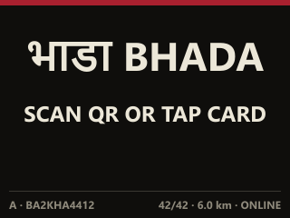
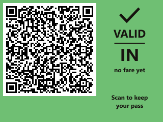
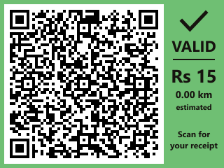
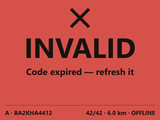
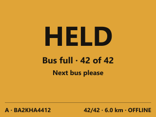

# Bhada door validator (Raspberry Pi prototype)

A box beside a bus door. A passenger holds up the BT1 ride code on their phone,
or taps a rider card, and the box decides on the spot, with no network: boarded,
let off with a fare and a receipt, refused, or held because the bus is full.

It is **not a new implementation of the door.** It runs `src/device/terminal.js`,
the same file the conductor's phone runs, unchanged, under Node. The Pi only adds
what a phone had for free: a clock it can trust, a scanner, a card reader, a
screen, a light and a buzzer.

| Idle | Boarded (BO1 pass) | Closed (BM1 receipt) | Refused | Held |
|---|---|---|---|---|
|  |  |  |  |  |

Every QR above is decoded again from the rendered pixels by `npm run proof:validator`.

---

## 1. Architecture as it stands

```
PASSENGER PHONE          DOOR VALIDATOR (this)                         METER BOX
BT1 ride code  ──QR──▶   GM65 ─▶ scan-input ─▶ core ─▶ terminal.js     odometer, count,
                         PN532 ─▶ nfc adapter ─┘       │ (unchanged)    capacity
rider card     ──NFC──▶                                 │
                         DS3231 ─▶ clock gate ──────────┤               ◀── RS-485 ──
                         TFT ◀── screens ◀── snapshot ──┤   32-byte protocol/frame.mjs
                         LED, buzzer ◀── verdict ───────┘   heartbeat, once a second
                         SQLite (legs, pairing, cards) ─▶ sync.js ─▶ backend, when there is one
```

- **Verdicts:** `terminal.js` → `verifyTap()` / `verifyPass()` / `resolveDistance()` /
  `priceDistance()` / `signPass()` / `signLeg()` in `protocol/`. Unchanged.
- **Board or alight:** decided by the door from whether that key has a ride open.
  One gesture, either door, as on the phones.
- **Offline:** validation never touches the network. The proof replaces `fetch`
  with a trap and runs every scenario through it.
- **Upload:** see §6b. Store and forward over HTTPS to the same sync function
  the phones use.

## 2. Browser APIs the door uses, and what stands in for each

`validator/loader.mjs` redirects four imports made from `src/`. Nothing in
`protocol/` is touched.

| Browser API | Used by | Pi adapter |
|---|---|---|
| IndexedDB (`idb`) | `storage/db.js` ← terminal, fleet, identity, sync | `adapters/store.mjs` — the same get/put/add/getAll/index/transaction surface on `node:sqlite`, WAL, `synchronous=FULL` |
| BroadcastChannel + Supabase Realtime | `device/link.js` | `adapters/link.mjs` — `state` messages from the RS-485 heartbeat or the vehicle odometer |
| Web NFC (`NDEFReader`) | `device/nfc.js` | `adapters/nfc.mjs` + `hw/pn532.mjs` — card serials, formatted as Chrome formats them |
| Wake Lock, Battery Status | `device/positioning.js` | `adapters/positioning.mjs` — no-ops; power is `hw/power.mjs` |
| Geolocation | `terminal.js` `startPositioning()` | Absent on Node, so the door logs "No GNSS" and uses the vehicle odometer from the link |
| Camera + jsQR | `Terminal.jsx` `Scanner` | `hw/scanner.mjs` — GM65/GM805 on a serial line |
| React screen | `Terminal.jsx` | `ui/screens.mjs` (model) + `ui/render.mjs` (SVG → RGB565) + `ui/display.mjs` (`/dev/fb1`) |
| `import.meta.env` | `sync.js` | Replaced by the loader with `BHADA_SYNC_URL` / `BHADA_ANON_KEY` |

## 3. Reused unchanged

`verifyTap`, `buildTap`, `signTap`, `verifyPass`, `buildPass`, `signPass`,
`buildLeg`, `signLeg`, `verifyLeg`, `TAP_MAX_AGE_S`, `PASS_MAX_AGE_S`
(`protocol/leg.mjs`); `priceDistance`, `resolveDistance`, `initialOdometer`,
`applyFix`, `TARIFF` (`protocol/meter.mjs`); `encodeFrame`, `decodeFrame`,
`crc32`, `FLAG` (`protocol/frame.mjs`); `assessPower` (`protocol/crew.mjs`);
`createKeypair` (`protocol/token.mjs`); and all of `src/device/terminal.js`,
`fleet.js`, `identity.js` and `sync.js`.

## 4. What the Pi adds (the missing hardware abstractions)

| Seam | Interface | Implementations |
|---|---|---|
| Scanner | bytes → `createScanAssembler` → `screenCode` → door | `hw/scanner.mjs` (UART or USB CDC), stdin on a bench; `src/lib/scan-input.js` is shared with the phone |
| Card reader | `onCard(fn)`, `readNfcCard()` | `hw/pn532.mjs` (HSU), fake UART in the proof |
| Clock | `status() → { trusted, reason }` | DS3231 via `/sys/class/rtc/rtc0`, NTP when synchronised, meter heartbeat; `createClockGate` takes the first trusted one |
| Odometer | `getVehicleOdometer() → { metres, at, unitId, source }` | meter heartbeat, manual, simulated. **No vehicle bus protocol is assumed** |
| Vehicle | `state` messages for the door | `hw/vehicle.mjs` — the meter wins when heard |
| RS-485 | byte stream → frames | `hw/rs485.mjs` slides a 32-byte window until version and CRC-32 agree; no sync word added |
| Signals | `show(kind)` | `hw/signals.mjs` through `pinctrl`; a recording fake |
| Power | `readFeed() → true / false / null` | `hw/power.mjs` → `assessPower()` → `deviceEvents` as kind `power` |

### Two rules the validator adds, and why

- **Clock gate.** If no source is trusted — no RTC, the RTC's oscillator-stop
  flag is set, the system clock and the RTC are more than 2 s apart, or the year
  is before 2026 — the validator shows **CLOCK NOT SET** and refuses ride codes
  and cards before the door is asked. A phone's clock is set by its network; a
  Pi's is not, and a door 10 minutes out refuses every honest passenger or
  accepts codes the backend will later refuse.
- **Pairing lock.** A phone door is paired through its own screen by the crew.
  A validator's scanner faces the public, so a BHPAIR1 pairing code is accepted
  through it **only while the validator has no key**. Otherwise anyone with a
  QR could re-key the door and strand every fare it takes. To re-pair: stop
  the service and delete the `pairing` row, or wipe `/var/lib/bhada`.

## 5. Tests

`npm run proof:validator` — 122 checks, in `npm run proof:all` and so in the
Vercel build gate. Sections:

1. Scanner input: CR/LF/CRLF/silence end a scan; URLs, Wi-Fi stickers, markup,
   floods screened out; repeat reads swallowed; phone OTG keyboard wedge
2. 300-second window: 300 s accepted, 301 refused, both directions; the same
   300 in the latest `settle_leg()`; a door clock 10 min out refuses honest codes
3. Clock: DS3231 trusted, 2 s drift ok, 3 s not, EINVAL (lost time), ENOENT (no
   RTC), never set, NTP after coming into signal, meter heartbeat fallback
4. PN532 frames against the NXP manual's examples; bad checksum dropped; a
   7-byte NTAG serial formatted as Chrome formats it
5. RS-485: frames found after joining mid-stream, in 7-byte pieces; a corrupted
   frame dropped and the next one kept; every field round-trips
6. Odometer adapter: shape, 5 s freshness, meter wins
7. The unchanged door on the adapters: unpaired, pairing lock, valid BT1,
   duplicate scan, malformed, bad signature, wrong vehicle, expired, 299 s edge,
   a ride priced by the vehicle odometer (4200 m = tariff), BM1 verifies,
   `tapQr` on the close is the boarding tap, clock gate, **zero fetch calls**
8. Interlock: full bus refuses boarding (HELD, amber, simulated door holds); a
   rider already aboard is let off at the same door
9. Screens: every state renders at 320×240; each QR decodes from the pixels
10. Power: `power_lost` after 2 min off with the bus moving; nothing for a parked
    bus; sync.js sends it as a meter event and puts nothing on the door tape;
    an unclean shutdown is noted at boot and written to neither tape
11. Storage: a committed leg and the pairing are on disk before any close
12. Rider cards through a fake PN532: enrolled card boards, resting card is not
    read twice, re-tap closes the ride, unknown card refused, clock gate
13. Uplink: a self-keyed vehicle validator; no signal keeps the ride queued and
    backs off; signal back sends one JSON POST with the receipt and the
    passenger's tap and the key announcement; nothing is sent twice; settled
    rides are pruned after 14 days

`npm run validator:screens` writes the screens to `docs/validator/`.
`npm run validator:bench` runs the whole validator on a laptop (§8).

No fixed cryptographic vectors exist in `scripts/`: every proof makes fresh keys
with `protocol/`'s own functions, and this one does the same.

---

## 6b. Getting the data to the database

The box never asks the backend whether a ride is allowed. It decides, stores
the ride in SQLite, and sends it up later. `validator/uplink.mjs`:

```
ride decided at the door ──▶ SQLite on the card (fsynced before the screen says ✓)
                                   │  whenever there is internet
                                   ▼
            HTTPS POST, JSON ──▶ supabase/functions/sync ──▶ settleBatch() ──▶ settle_leg()
            { devicePublicKey,        verifies the vehicle's     debits wallet_for(passenger),
              legs: [{ receipt,       BM1 signature and the      credits the operator, once
                       tap }],        passenger's BT1, re-prices
              meter?: {...} }         from the published tariff
```

| Question | Answer |
|---|---|
| Which protocol? | HTTPS POST of JSON to the sync Edge Function, the same batch format the phones send (`src/device/sync.js`). No MQTT broker, no new server |
| How does the bus get internet? | Any IP link: a 4G USB dongle in HiLink mode (it appears as a network card), the conductor's phone hotspot, or depot Wi-Fi at the terminus. Validation does not care which, or whether |
| What if the upload dies half way? | Every receipt is idempotent: a second copy is answered `replay`, never charged twice. The queue is only cleared for rows the backend has ruled on |
| What if the bus is offline for a week? | Rides stay queued on the card and go up 150 at a time when signal returns. Retries back off from 1 to 10 minutes while there is none |
| How is it authenticated? | By signatures, not passwords. Each receipt is signed by the vehicle key, each ride carries the passenger's BT1, and the vehicle key is frozen on first sight by `register_meter()`. The only credential in the config is the public anon key the website already ships |
| Who registers the vehicle key? | With a phone meter on the bus, the meter does. With `BHADA_ROLE=vehicle` the box is the whole bus: it makes the key on first boot and announces it with every upload |
| Does the card fill up? | Settled rides are deleted after 14 days (`KEEP_SETTLED_DAYS`); a BO1 pass is only good for 6 hours |
| How does the owner know a box is alive? | Every upload is the heartbeat: the owner dashboard's sync health shows which bus stopped reporting. `journalctl -u bhada-validator` on the box shows the queue |

## 6. Hardware

| Part | Notes |
|---|---|
| Raspberry Pi Zero 2 **WH** | Headers soldered. Raspberry Pi OS Lite 64-bit, Bookworm |
| GM65 or GM805 QR module | Must say it reads **mobile phone screens**. USB virtual COM (`/dev/ttyACM0`) or TTL UART |
| PN532 module | HSU mode (both DIP switches off on the common boards) |
| 2.8" ILI9341 SPI TFT, 320×240 | 2.4" works; 1.3–1.44" is too small for a receipt QR (v9–v10, 3–4 px a module here) |
| DS3231 module + CR2032 | Keeps time with the power off |
| RGB LED (common cathode) + 3 × 330 Ω | |
| Active 5 V buzzer + NPN transistor | Driven from a GPIO |
| High-endurance microSD, 32 GB | |
| Micro-USB OTG hub | The Zero has one USB port: scanner, and later the RS-485 adapter |
| **Vehicle DC-DC converter**, 12/24 V in → 5 V 3 A out | Automotive-rated: wide input (9–36 V), load-dump and reverse-polarity protected. **Never wire bus power to the Pi directly** |

No battery. No GPS: distance comes from the vehicle's odometer.

### Wiring (BCM numbering)

| Pi pin | To |
|---|---|
| GPIO 14 (TXD), 15 (RXD) | PN532 RX, TX (HSU) |
| GPIO 2 (SDA), 3 (SCL), 3V3, GND | DS3231 |
| GPIO 10 (MOSI), 11 (SCLK), 8 (CE0), 24 (DC), 25 (RST), 3V3, GND | ILI9341; backlight to 3V3 through its resistor |
| GPIO 5, 6, 13 | LED red, green, blue |
| GPIO 12 | Buzzer transistor base (1 kΩ) |
| GPIO 26 | Vehicle feed sense, through an optocoupler — only when used (§7) |
| USB | GM65 (USB COM mode); USB-RS485 adapter in stage 6 |

**No pin goes to a door.** The prototype shows the decision (light, sound, screen,
and a `door A: hold` / `release` line in the log) and never actuates anything.

## 7. Power cuts

The validator runs from the bus through the DC-DC converter and has no battery,
so when the bus's power goes, the Pi stops mid-instruction. Software cannot make
that safe on its own; what this build does to make it survivable:

- Every tap is one SQLite commit, fsynced before the door answers
  (`synchronous=FULL`, WAL). A pass or receipt on the screen is already on disk.
- Nothing else writes in normal running: no odometer writes (there are no GPS
  fixes), no log files of its own (stdout goes to journald), screens are never
  saved. A boot writes one small marker.
- `setup.sh` removes `fake-hwclock` and lets the kernel set the time from the
  DS3231 at boot; `bhada-validator.service` runs `hwclock --hctosys` first.
- Recommended, by hand (listed at the end of `setup.sh`): a separate ext4
  partition for `/var/lib/bhada` with `data=journal,commit=1`, and the read-only
  overlay root, so a cut can only ever affect the one small data partition.
- At boot the validator notes whether the last run ended cleanly. That note
  stays in its own diagnostics and is **not** `power_lost`: a parked bus has its
  master switch turned off every night.

`power_lost` itself needs the validator to **stay up while the meter's feed goes**:
the validator on the bus's permanent (battery-direct) supply, and an
optocoupler from the switched feed to GPIO 26 (`BHADA_FEED_SENSE=26`). Then
`hw/power.mjs` feeds `assessPower()` — the same rule the phone meter uses — and a
pulled plug on a moving bus goes into `deviceEvents` as kind `power`, which
`sync.js` sends as a **meter event**. It never goes in `door_events`.

## 8. Build stages

| Stage | What | State |
|---|---|---|
| 0 | USB scanner on the existing Android door phone (OTG, keyboard mode) | Done: `Terminal.jsx` listens for it. Time 25 boardings with the camera, then the scanner |
| 1 | Phone BT1 → GM65 → Pi → `verifyTap()` → VALID / INVALID → TFT, buzzer, LED | Code done and proved; needs the parts |
| 2 | PN532 → the door's existing card flow | Code done and proved against a simulated PN532 |
| 3 | DS3231 → offline 300 s timing | Code done; `setup.sh` configures the kernel |
| 4 | Vehicle odometer adapter | Interface done; meter heartbeat and simulated sources |
| 5 | Vehicle power-loss handling | Code done; needs permanent-feed wiring to be meaningful |
| 6 | RS-485 meter link | Receiving done (heartbeat, frame sync); see below |

### On a laptop, now

```sh
npm run validator:bench                       # paste codes into this terminal
node validator/tools/codes.mjs pair           # paste the output first
node validator/tools/codes.mjs ride           # then a ride code; again to alight
```

The screen is written to `.bench/validator/screen.png`.

### On the Pi

```sh
sudo git clone <repo> /opt/bhada && sudo sh /opt/bhada/validator/deploy/setup.sh
```

## 9. What needs the real bus, or a decision, before it is finished

- **The parts.** Nothing here has run on a Pi Zero 2 W yet. The PN532 driver is
  written to NXP's manual and tested against its frames, not against a chip; the
  `fbtft` overlay line and `rotate=` need checking on the actual panel; GM65
  settings (USB COM, CR suffix, screen reading) are set with the vendor's codes.
- **The vehicle odometer.** No bus protocol is assumed. Reading a real odometer
  (CAN, J1939, a pulse sender, a fleet tracker) is a new adapter with the
  `getVehicleOdometer()` shape once there is a bus and its documentation.
- **Door to meter.** The heartbeat carries meter → door. A phone door tells the
  meter `boarded` / `alighted` so it can count heads for the interlock; there is
  no field for that in the frame and no agreed uplink on the wire, so the Pi logs
  those messages as `uplink (not sent)`. Choosing that format is a protocol
  decision, not an adapter, and it is left open on purpose. Until then the count
  that drives the interlock is whatever the meter box knows.
- **Two validators, one bus, no meter box.** Two doors each with their own
  store cannot see each other's open rides. The passenger's BO1 pass still
  closes the ride at the other door (it carries the boarding odometer), as on
  the phones.
- **Timing at a real door.** Stage 0 measures the scanner on a phone; the Pi's
  own scan-to-screen time (rasterising is the slow part) needs measuring on the
  Zero 2 W.
- **Enclosure, EMC, vibration, heat.** Not addressed.
